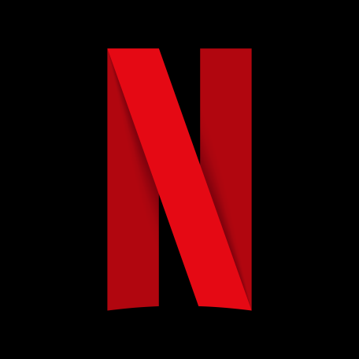

<!-- Improved compatibility of back to top link: See: https://github.com/othneildrew/Best-README-Template/pull/73 -->

<!--
*** Thanks for checking out the Best-README-Template. If you have a suggestion
*** that would make this better, please fork the repo and create a pull request
*** or simply open an issue with the tag "enhancement".
*** Don't forget to give the project a star!
*** Thanks again! Now go create something AMAZING! :D
-->

<!-- PROJECT SHIELDS -->
<!--
*** I'm using markdown "reference style" links for readability.
*** Reference links are enclosed in brackets [ ] instead of parentheses ( ).
*** See the bottom of this document for the declaration of the reference variables
*** for contributors-url, forks-url, etc. This is an optional, concise syntax you may use.
*** https://www.markdownguide.org/basic-syntax/#reference-style-links
-->
[![Contributors][contributors-shield]][contributors-url]
[![Forks][forks-shield]][forks-url]
[![Stargazers][stars-shield]][stars-url]
[![Issues][issues-shield]][issues-url]
[![LinkedIn][linkedin-shield]][linkedin-url]

<!-- PROJECT LOGO -->
 

  

<h3 align="center">Netflix API</h3>

  

    Este projeto consiste em uma API capaz de ler um arquivo .csv, popular o banco de dados as informações do arquivo sendo também capaz de exibir os registros em json. O arquivo lido consiste em uma lista de filmes e séries da Netflix.
     
     
     
    ·
    <a href="https://github.com/joaogdfaero/Netflix_API/issues">Report Bug</a>
    ·
    <a href="https://github.com/joaogdfaero/Netflix_API/issues">Request Feature</a>
  

## Requisitos do Projeto

● A leitura do arquivo .csv deve ser através de um endpoint diferente da listagem de títulos;

● Ordenar pelo ano de lançamento;

● Filtrar os registros por ano de lançamento, gênero, país*;

● Garantir que não haja duplicidade de registros;

## API Documentation (Postman)  

[Link](https://documenter.getpostman.com/view/24543977/2s93zCXzWV) 

## Tecnologias:
* Ruby 3.0.2
* Rails 7.0.4.3
* SQlite3

## Instalação
1. **Clone este repositório**  
` git clone https://github.com/joaogdfaero/Netflix_API.git`

2. **Acesse a pasta do projeto**  
` cd Netflix_API `

3. **Instale as gems necessárias**  
` bundle `

4. **Execute o servidor da aplicação**  
` rails s `

5. **O servidor inciará na porta: 3000 - acesse:**    
` http://localhost:3000 `

##
 Author: <strong>João Gabriel Dal Forno (joao.dal@acad.ufsm.br)</strong>

(<a href="#readme-top">Voltar ao topo</a>)

<!-- MARKDOWN LINKS & IMAGES -->
<!-- https://www.markdownguide.org/basic-syntax/#reference-style-links -->
[contributors-shield]: https://img.shields.io/github/contributors/joaogdfaero/Netflix_API.svg?style=for-the-badge
[contributors-url]: https://github.com/joaogdfaero/Netflix_API/graphs/contributors
[forks-shield]: https://img.shields.io/github/forks/joaogdfaero/Netflix_API.svg?style=for-the-badge
[forks-url]: https://github.com/joaogdfaero/Netflix_API/network/members
[stars-shield]: https://img.shields.io/github/stars/joaogdfaero/Netflix_API.svg?style=for-the-badge
[stars-url]: https://github.com/joaogdfaero/Netflix_API/stargazers
[issues-shield]: https://img.shields.io/github/issues/joaogdfaero/Netflix_API.svg?style=for-the-badge
[issues-url]: https://github.com/joaogdfaero/Netflix_API/issues
[license-shield]: https://img.shields.io/github/license/joaogdfaero/Netflix_API.svg?style=for-the-badge
[license-url]: https://github.com/joaogdfaero/Netflix_API/blob/master/LICENSE.txt
[linkedin-shield]: https://img.shields.io/badge/-LinkedIn-black.svg?style=for-the-badge&logo=linkedin&colorB=555
[linkedin-url]: https://www.linkedin.com/in/jo%C3%A3o-gabriel-dal-forno/
[product-screenshot]: images/screenshot.png
[Next.js]: https://img.shields.io/badge/next.js-000000?style=for-the-badge&logo=nextdotjs&logoColor=white
[Next-url]: https://nextjs.org/
[React.js]: https://img.shields.io/badge/React-20232A?style=for-the-badge&logo=react&logoColor=61DAFB
[React-url]: https://reactjs.org/
[Vue.js]: https://img.shields.io/badge/Vue.js-35495E?style=for-the-badge&logo=vuedotjs&logoColor=4FC08D
[Vue-url]: https://vuejs.org/
[Angular.io]: https://img.shields.io/badge/Angular-DD0031?style=for-the-badge&logo=angular&logoColor=white
[Angular-url]: https://angular.io/
[Svelte.dev]: https://img.shields.io/badge/Svelte-4A4A55?style=for-the-badge&logo=svelte&logoColor=FF3E00
[Svelte-url]: https://svelte.dev/
[Laravel.com]: https://img.shields.io/badge/Laravel-FF2D20?style=for-the-badge&logo=laravel&logoColor=white
[Laravel-url]: https://laravel.com
[Bootstrap.com]: https://img.shields.io/badge/Bootstrap-563D7C?style=for-the-badge&logo=bootstrap&logoColor=white
[Bootstrap-url]: https://getbootstrap.com
[JQuery.com]: https://img.shields.io/badge/jQuery-0769AD?style=for-the-badge&logo=jquery&logoColor=white
[JQuery-url]: https://jquery.com 

